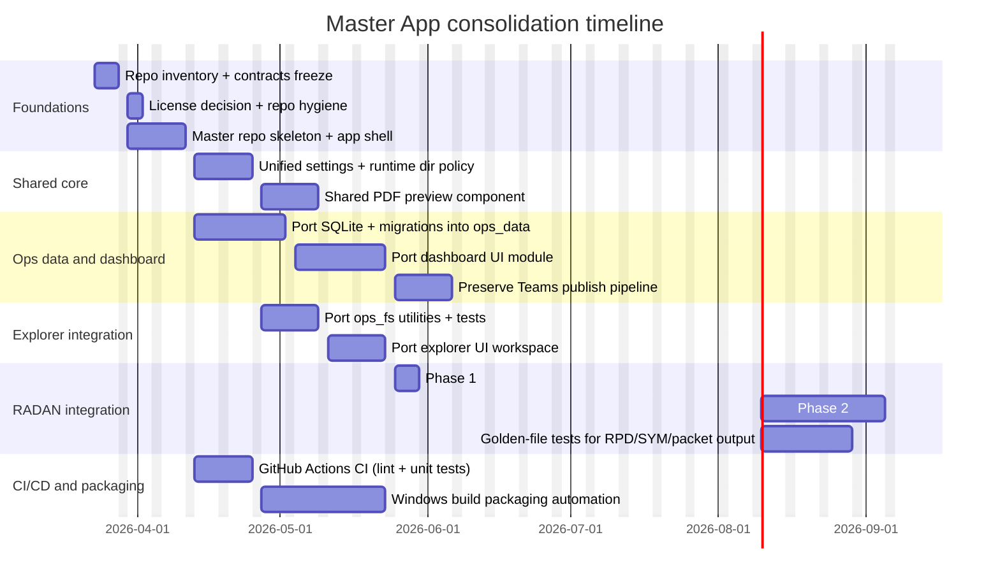

# Consolidating the cameroneevenson-lgtm repositories into a single application

## Executive summary

As of March 19, 2026, the public GitHub profile at `https://github.com/cameroneevenson-lgtm?tab=repositories` shows **three** public repositories—`truck_nest_explorer`, `fabrication_flow_dashboard`, and `radan_kitter`—not four. A fourth component is strongly implied by code and documentation (`inventor_to_radan` is referenced as a tool path and workflow step), but it is **not publicly visible** under that account, so its README/codebase could not be reviewed directly in this research pass. citeturn37view0turn42view0turn32view0

All three visible repositories are **Windows-first Python desktop applications** built around **PySide6**, with consistent operational concepts (trucks, kits, L/W side folders, `_runtime` scratch areas, batch/PowerShell launchers, and local artifacts). This creates a strong foundation for consolidation into a **single “Ops Suite” desktop app** with shared services and a modular UI shell. citeturn42view0turn38view0turn33view0turn23view5

The lowest-risk consolidation strategy is a **two-speed integration**: (1) build a new master shell that embeds or launches the existing apps behind stable module boundaries, and (2) incrementally refactor “good” shared components (PDF preview, path discovery, settings, SQLite ops data, Teams publishing) into a shared core library—starting with the most volatile/early-stage code (`truck_nest_explorer`) and the most “data-spine” code (`fabrication_flow_dashboard`), while treating `radan_kitter` as a semi-independent module until parity tests and file-format safety gates are in place. citeturn42view0turn38view1turn30view0turn11view1turn40view1

## Repository landscape and comparison

### Primary sources reviewed
Public repositories (links in code format to comply with URL rules):

```text
https://github.com/cameroneevenson-lgtm/truck_nest_explorer
https://github.com/cameroneevenson-lgtm/fabrication_flow_dashboard
https://github.com/cameroneevenson-lgtm/radan_kitter
```

The profile shows these three repos as public, with recent updates on March 18–19, 2026. citeturn37view0

### Comparison table

| Repo | Primary purpose | Languages (GitHub) | UI / framework | Key modules (representative) | “APIs” / integrations | Data stores & artifacts | Tests | CI/CD | License status (observed) |
|---|---|---|---|---|---|---|---|---|---|
| `truck_nest_explorer` | Workflow hub: browse truck kit folders, scaffold L-side `.rpd` structures, run `inventor_to_radan`, copy outputs, launch `radan_kitter`; includes nest PDF preview and “punch-code notes” + hide/unhide | Python 97.7%, Batchfile 2.3% citeturn33view2 | PySide6 desktop app citeturn42view0turn13view0 | `services.py`, `models.py`, `settings_store.py`, `pdf_preview.py`, `main_window.py`, batch launchers citeturn42view0turn14view9turn14view8 | Runs external tool entrypoint based on suffix (`.py` vs `.bat/.cmd`), via `subprocess.run`; launches other tools via `subprocess.Popen` citeturn14view6turn14view7 | `_runtime/settings.json`; filesystem discovery rooted at Windows drives (`L:\...`, `W:\...`); generates/copies `*_Radan.csv` + report into L-side project folder citeturn14view9turn32view2turn42view0 | `tests/test_services.py` uses `unittest` and covers preview PDF detection, copying Inventor outputs, truck discovery, hide/unhide logic, alias mapping citeturn17view3turn14view10 | Actions tab shows “getting started” page; no workflow evidence found in repo tree snapshot citeturn18view0turn42view0 | No `LICENSE` file visible in repository file list snapshot citeturn42view0 |
| `fabrication_flow_dashboard` | Ops dashboard: track fabrication status by truck/kit, schedule-aware visualization + risk/health signals; publishes compact snapshot as Teams Adaptive Card | Python 98.5% citeturn33view1 | PySide6 desktop app citeturn38view0turn12view1 | `database.py`, `models.py`, `schedule.py`, `metrics.py`, `teams_card.py`, `publish_artifacts.py`, `export_ops_snapshot_teams_card.py`, `board_widget.py` citeturn38view1turn30view0turn26view5turn26view9 | HTTP webhook POST to Teams (via `post_json_webhook`), Adaptive Card generator, artifact link resolution citeturn38view5turn41view0turn26view5 | Local SQLite `fabrication_flow.db`; CSV intake `truck_registry.csv`; published artifacts in `_runtime/published` (`summary.html`, `status.json`, `gantt.png`) citeturn38view2turn12view4turn26view9turn38view1 | No explicit tests folder visible in repo tree snapshot citeturn42view1 | Actions tab shows “getting started” experience; no workflow evidence found in repo tree snapshot citeturn18view1turn42view1 | No `LICENSE` file visible in repository file list snapshot citeturn42view1 |
| `radan_kitter` | Specialist production tool: parses `.rpd`, assigns “kit” labels, generates kit `.sym` files (donor-template based), builds watermarked print packet PDFs, includes ML signal pipeline and COM research notes | Python 97.9%, Batchfile 1.7%, PowerShell 0.4% citeturn33view0 | PySide6 desktop app; deeper UI layering (`ui_*`) citeturn23view5turn9view0 | `rpd_io.py`, `sym_io.py`, `kit_service.py`, `packet_service.py`, `pdf_packet.py`, `pdf_preview.py`, `ml_pipeline.py`, `config.py` citeturn11view1turn11view3turn9view4turn40view1turn36view7turn36view1 | File-system & OS integrations: `os.startfile`, `explorer.exe /select`, subprocess; research into RADAN COM surface (registry findings) citeturn23view5turn24view0turn9view6 | Requirements include PySide6, PyMuPDF, ezdxf, numpy, pandas, scikit-learn, joblib, matplotlib; runtime trace JSONL in `_runtime/runtime_trace.jsonl`; donor template `KitDonor-100Instances.sym`; packet output naming `PrintPacket_QTY_<stamp>.pdf` citeturn8view2turn36view1turn36view2turn40view1 | No explicit tests folder visible in repo tree snapshot citeturn42view2 | Actions tab shows generic “getting started” page; no workflow evidence found in repo tree snapshot citeturn18view2turn33view0 | No `LICENSE` file visible in repository file list snapshot citeturn33view0 |
| *(Fourth repo expected)* `inventor_to_radan` | BOM/spreadsheet → RADAN import conversion tool (inferred), invoked by `truck_nest_explorer` | Unknown | Unknown | Unknown | Called as external entrypoint (default path `C:\Tools\inventor_to_radan\inventor_to_radan.py`) and expected to emit `*_Radan.csv` + report citeturn32view0turn42view0turn17view3 | Outputs copied into L-side project folder; file naming in tests suggests `TruckBom_Radan.csv` + `TruckBom_report.txt` citeturn17view3turn14view6 | Unknown | Unknown | Unknown |

## Overlapping functionality and integration opportunities

Across the three visible repos, the overlap is best understood as **three layers of the same operational workflow**:

**Operational data spine (what is “true” about trucks/kits and schedule):** `fabrication_flow_dashboard` owns canonical operational state in SQLite and syncs intake from `truck_registry.csv`, then derives schedule insights (lag windows, concurrency items, release holds) and produces publishable artifacts and Teams payloads. Tellingly, it specifies a stable domain model (`Truck`, `TruckKit`, `KitTemplate`) and a persistent schema with migrations (e.g., “rename legacy pack names” and ensuring blocked fields remain aligned). citeturn38view2turn30view0turn30view6turn26view3turn28view2

**Workflow orchestration + file-system reality (where the truck kit folders and project artifacts actually live):** `truck_nest_explorer` focuses on L/W folder discovery, scaffold creation, selecting the right spreadsheet/PDF files, triggering conversion (`inventor_to_radan`), copying outputs back to L, then launching the kitter, with persistent user settings in `_runtime/settings.json`. Its own test suite emphasizes correctness of discovery rules (depth limits, excluding irrelevant PDFs, case-insensitive matching, “only release_root is used”, hide/unhide behavior, and alias normalization). citeturn42view0turn14view7turn14view9turn17view3turn32view2

**Deep production transformation tooling (modifying or generating RADAN artifacts):** `radan_kitter` is a specialized toolchain for `.rpd` parsing and `.sym` generation (including updating/commenting attribute 109), packet generation with PyMuPDF-based processing, and ML feature collection with a locked signal schema. It also contains explicit evidence of operational conventions (network drive roots, `_bak/_out/_kits` directory naming, runtime tracing, donor template fallback behavior). citeturn11view1turn11view2turn11view3turn40view1turn36view2turn36view6

### Overlaps worth consolidating into shared modules

**Shared “truck/kit naming and canonicalization” logic:**  
`fabrication_flow_dashboard` keeps a mapping of canonical kit names and actively migrates old pack names into new ones in SQLite, implying that name-shape consistency is important to the workflow and data durability. citeturn26view3turn30view2turn30view6  
Simultaneously, `truck_nest_explorer` supports kit aliases (display name vs RADAN-facing name) and canonicalizes user settings like hidden kits and punch-code maps against the canonical kit templates list. citeturn33view2turn15view0turn17view3

**Shared “PDF preview” widget functionality (duplicated):**  
`truck_nest_explorer` includes a straightforward PyMuPDF render path (`fitz.open(...)`, `page.get_pixmap(...)`, convert to `QImage`/`QPixmap`). citeturn14view8  
`radan_kitter` also uses PyMuPDF in a richer preview implementation (with higher DPI and caching constants), strongly suggesting you should standardize on a single PDF preview component and reuse it across the consolidated app. citeturn11view8turn11view7turn8view2

**Shared `_runtime` and “published artifacts” conventions:**  
Both the dashboard and explorer rely on `_runtime` as a persistent-but-local scratch area (`_runtime/published/...` artifacts in the dashboard; `_runtime/settings.json` in the explorer). `radan_kitter` uses `_runtime` for trace logging and hot reload request/response files. Standardizing a single runtime directory scheme (per-app + per-user) will reduce path bugs and simplify packaging. citeturn26view9turn14view9turn36view1

**Shared “hot reload / dev launcher” approach:**  
`fabrication_flow_dashboard` documents a `dev_run.bat` flow plus `watch_and_run.py`, with an in-app banner and reload decision window. citeturn38view0turn38view3  
`truck_nest_explorer` similarly documents `dev_run.bat` with a hot reload banner and accept/cancel behavior. citeturn33view2turn42view0  
`radan_kitter` also describes safe restart hot reload managed by batch scripts to avoid unsafe in-process reloads for PySide6. citeturn11view10turn36view1

### Capabilities that should remain distinct (at least initially)

**RADAN file transformations and packet generation** are high-risk to change because correctness is defined by external consumers (RADAN, manufacturing/export conventions, and file-format semantics). The code shows the kitter directly constructs outputs in predictable patterns (e.g., `PrintPacket_QTY_<stamp>.pdf` in an output folder relative to the `.rpd`). citeturn40view1turn11view1

**Teams publishing** has explicit payload constraints and degradation logic. The dashboard explicitly builds Adaptive Card payloads (`"type": "AdaptiveCard"`, version `"1.4"`) and publishes them to a webhook, and your consolidated app should preserve the dashboard’s tested heuristics for payload size and artifact linking. citeturn26view5turn38view5turn41view0turn12view1  
Also, the platform-level webhook limit is documented as **28 KB** for message size, which materially affects any consolidation that tries to “add more info to the card.” citeturn39view3turn12view1

## Proposed unified architecture and module boundaries

### Unifying principle

Build a **single PySide6 desktop application** (one `QApplication`, one primary `QMainWindow`) that hosts multiple “workspaces” (Dashboard, Explorer, Kitter, Tools). Keep cross-module coupling low by enforcing a small set of **shared domain contracts**:

- **Ops domain**: trucks, kits, stages, schedule windows, blockers, artifact links. citeturn12view1turn26view3turn28view2  
- **Filesystem domain**: release roots, fabrication roots, project folder conventions, “L/W handoff”, controlled discovery depth and matching rules. citeturn32view2turn17view3turn42view0  
- **RADAN transformation domain**: RPD parsing, SYM generation, donor templates, packet generation, ML feature schema, and optional COM automation research. citeturn11view1turn11view3turn36view2turn24view0turn36view6

### Recommended consolidation pattern

Start with a **modular monolith** plus a cautious adapter layer:

- **Phase 1 (safe):** Embed the Explorer and Dashboard as internal modules; treat `radan_kitter` (and `inventor_to_radan`) as **subprocess-invoked “tools”** behind stable interfaces (“run and parse outputs”), matching how the explorer already interacts with external entrypoints by suffix. citeturn14view6turn14view7turn42view0  
- **Phase 2 (deeper):** Gradually pull `radan_kitter` core services (`rpd_io`, `sym_io`, `packet_service`, ML feature extraction) into shared packages, and only then unify UI (to avoid destabilizing production flows). citeturn11view1turn11view3turn40view1turn36view7

### A concrete module/component blueprint

| Proposed module | What it owns | Primary source alignment |
|---|---|---|
| `ops_core` | Shared config model, path normalization utilities, logging/tracing facade, versioning, runtime directory policy | `_runtime` patterns across all three repos; `radan_kitter` runtime trace paths in config citeturn26view9turn14view9turn36view1 |
| `ops_domain` | Canonical domain entities: Truck, TruckKit, Stage, schedule insight DTOs; canonical kit naming & alias rules | `fabrication_flow_dashboard/models.py`, `stages.py`, `schedule.py`; alias/canonicalization logic in explorer tests/settings citeturn26view3turn28view2turn33view2turn17view3 |
| `ops_data` | SQLite access layer and migrations; import/sync from `truck_registry.csv`; publish artifact generation (`summary.html`, `status.json`, `gantt.png`) | Dashboard schema creation/migrations; publish artifacts pipeline citeturn30view0turn30view6turn26view9turn38view2 |
| `ops_dashboard_ui` | Board widget, gantt overlay, metrics panels, “Publish to Teams” UI | Dashboard scope and module responsibilities as described in spec/README citeturn12view1turn38view1 |
| `ops_teams` | Adaptive Card builders, payload sizing/degradation strategy, webhook post client, artifact link resolution | `teams_card.py` schema, publish order, CLI exporter uses `post_json_webhook` citeturn26view5turn38view5turn41view0turn39view3 |
| `ops_fs` | Truck discovery, kit scaffold creation, spreadsheet/PDF detection rules, copy/sync utilities | Explorer workflow and tests, depth rules and copy semantics citeturn42view0turn17view3turn14view7 |
| `ops_pdf_ui` | Shared PDF preview widget and policies (cache, DPI, error display) | PDF preview exists in both explorer and kitter; kitter has performance controls citeturn14view8turn11view8turn11view7 |
| `radan_core` | `rpd_io`/`sym_io`, donor-template kit build, packet generation, controlled file writes and backups | `PartRow` dataclass and load function; donor-template kit build; packet output naming citeturn11view1turn11view3turn40view1turn9view4 |
| `radan_ml` | ML signal schema locks, dataset handling, feature extraction pipeline | Locked list references config as source of truth; ml pipeline schema sections citeturn36view6turn36view7turn36view2 |
| `radan_ui` | Kitter UI (table, numpad controller, preview pane) once stabilized | `radan_kitter.py` imports and UI module structure citeturn23view5turn42view2 |
| `tools_inventor_to_radan_adapter` | A stable CLI contract: input spreadsheet path → outputs (`*_Radan.csv`, report) | Explorer workflow description + default entry path; tests for output copy naming citeturn42view0turn32view0turn17view3 |

### Illustrative integration diagram

```mermaid
flowchart TB
  subgraph UI[Master PySide6 Desktop Shell]
    Nav[Workspace navigation]
    Dash[Ops Dashboard workspace]
    Exp[Truck/Kit Explorer workspace]
    Kit[RADAN Kitter workspace]
    Tools[Tools workspace]
  end

  subgraph Core[Shared libraries]
    Domain[ops_domain]
    Data[ops_data]
    FS[ops_fs]
    PDF[ops_pdf_ui]
    Teams[ops_teams]
    RadanCore[radan_core]
    RadanML[radan_ml]
  end

  ExtTeams[Teams Incoming Webhook]
  ExtFS[Network drives L:/W:]
  ExtRadan[RPD/SYM/PDF files]
  ExtInv[inventor_to_radan entrypoint]
  ExtRadanApp[radan_kitter subprocess (phase 1)]

  Nav --> Dash
  Nav --> Exp
  Nav --> Kit
  Nav --> Tools

  Dash --> Domain
  Dash --> Data
  Dash --> Teams

  Exp --> FS
  Exp --> PDF
  Exp --> Domain

  Kit --> RadanCore
  Kit --> RadanML
  Kit --> PDF

  Tools --> FS
  Tools --> ExtInv

  Teams --> ExtTeams
  FS --> ExtFS
  RadanCore --> ExtRadan

  %% Phase 1 bridge
  Kit -.subprocess adapter.-> ExtRadanApp
```

## Migration plan and timeline

### Key migration goals (what “done” should mean)

A successful consolidation should produce:

1. **One installer / one executable** (or one top-level distribution) with multiple workspaces.
2. **One source of truth** for ops state (SQLite) and one for user settings (config/settings), with explicit versioning and migration.
3. **Stable adapters** for external tooling (`inventor_to_radan`, RADAN app behaviors) until internal replacements are validated.
4. **A dependable CI pipeline** that runs unit tests, lints, and produces a build artifact (at least Windows), even if release remains manual at first. citeturn39view2turn42view0turn30view0turn14view9

### Implementation roadmap with effort estimates

Effort scale: **Low** (≤1–2 days), **Medium** (3–10 days), **High** (multi-week / high uncertainty).

| Milestone/task | What changes | Effort | Why |
|---|---|---|---|
| Create new “master” repo + package skeleton | New repo with `src/` layout, workspace modules, basic app shell | Medium | Structural work but isolated; prerequisite for everything else |
| Decide licensing strategy | Add explicit license file(s); set policy for internal/external reuse | Low–Medium | Very important for legal clarity; lack of visible license today implies ambiguity citeturn39view1turn42view0 |
| Extract shared config + runtime directory policy | Standardize `_runtime` and per-user config location; remove hardcoded tool paths from code into settings | Medium | Multiple repos currently hardcode paths (L/W roots, `C:\Tools\...`) citeturn32view2turn36view1 |
| Unify PDF preview as a shared widget | Replace duplicate preview implementations with one module | Medium | Two independent PDF preview codepaths exist (explorer vs kitter) citeturn14view8turn11view8 |
| Move `fabrication_flow_dashboard` into `ops_data` + `ops_dashboard_ui` modules | Preserve schema/migrations; preserve artifact publishing flow | High | Risk to operational data and Teams publishing pipeline; must preserve behavior citeturn30view0turn26view9turn41view0turn39view3 |
| Integrate explorer logic as `ops_fs` + `ops_explorer_ui` | Preserve depth rules, hide/unhide semantics, output copying | Medium | Good unit tests exist and can be ported as-is citeturn17view3turn14view6 |
| Phase-1 kitter integration via subprocess adapter | Master app launches kitter for a selected `.rpd` and tracks outputs | Low–Medium | Explorer already uses subprocess patterns; keep kitter stable citeturn14view6turn23view5 |
| Phase-2 kitter service extraction | Pull in `rpd_io`, `sym_io`, `packet_service` behind contracts; add safety/backup gates | High | File-format correctness risk; requires golden-file tests and rollback strategy citeturn11view1turn11view3turn40view1 |
| Add CI with lint/test/build | GitHub Actions: run unit tests; optional build artifacts | Medium | No workflows observed currently; automation reduces regression risk citeturn18view0turn39view2 |
| Packaging / installer | Use PySide6 deployment tooling (PyInstaller / Qt deployment guidance) | High | Desktop packaging is notoriously detail-heavy; needs repeatable automation citeturn39view0 |

### Gantt-style migration timeline (proposed)

The dates below assume project kickoff the next business week after the current date (March 19, 2026 in America/Toronto). Adjust durations based on team size and the risk tolerance for `radan_kitter` refactors.



### Suggested CI/CD changes

A pragmatic CI target for these repos is: **run tests and static checks on every PR, and produce a Windows build artifact on tagged releases**. This aligns well with GitHub Actions’ workflow model (YAML-defined workflows composed of jobs). citeturn39view2

Given the repos are PySide6-based and Windows-centric (drive-letter roots and `.bat` launchers), start with **Windows runners** first, then add Linux/macOS once path assumptions and packaging are abstracted. citeturn32view2turn42view0turn39view0

On deployment tooling: Qt for Python documentation explicitly describes using PyInstaller to freeze Python apps into standalone executables and notes Windows deployment steps may require deploying Qt plugins (e.g., `windeployqt`). That is consistent with why packaging should be treated as a dedicated milestone rather than an afterthought. citeturn39view0

## Risks, compatibility, testing, monitoring, and documentation

### Risk matrix

| Risk | Likelihood | Impact | Evidence / why it matters | Mitigation |
|---|---|---|---|---|
| Fourth repo (`inventor_to_radan`) not available for analysis | High | Medium–High | Explorer depends on it as a workflow step and hardcodes a default path; missing code hampers full consolidation design citeturn42view0turn32view0 | Treat as external tool with a strict adapter contract first; pull it into monorepo only after access is provided and input/output contracts are documented |
| Hardcoded Windows/network paths break portability and packaging | High | High | Explorer and kitter embed `L:\...`, `W:\...`, and `C:\Tools\...` defaults; kitter also maps L→W roots citeturn32view2turn36view2turn36view1 | Centralize into settings with environment overrides; add a “configuration diagnostics” page checking that roots exist |
| SQLite schema drift and backward incompatibility | Medium | High | Dashboard has explicit schema creation and migration logic (e.g., rebuild tables, rename legacy names, align blocker fields) citeturn30view0turn30view6turn31view2 | Preserve existing schema and migration routines; add schema version table and migration tests using real fixtures |
| RADAN file-format correctness regressions (.rpd/.sym) | Medium | Very High | `rpd_io` and `sym_io` directly parse/modify structured formats; `sym_io` edits Attr 109; outputs can affect production downstream citeturn11view1turn11view2turn11view3 | Golden-file test suite; “write-to-temp + atomic replace” strategy; forced backups (`_bak`) before writes; feature flags for new behavior |
| Packet generation quality/performance regressions | Medium | High | Packet generation produces `PrintPacket_QTY_<stamp>.pdf` and uses PyMuPDF page processing; concurrency is configurable and noted as potentially unstable in threaded mode citeturn40view1turn11view7turn11view6 | Benchmark tests; single-thread default; smoke tests on representative PDFs; observe memory/CPU usage |
| Teams publish payload size regressions after consolidation | Medium | High | Dashboard explicitly builds Adaptive Cards and has degradation logic; Teams incoming webhook size limit is 28 KB citeturn26view5turn12view1turn39view3 | Add automated “payload size gate” tests; keep degradation strategy intact; publish artifacts via links when payload grows |
| Missing explicit license creates legal ambiguity | Medium | Medium | No LICENSE file visible in root file lists for the public repos; packaging guidance recommends standard well-known licenses citeturn42view0turn39view1 | Decide and add license files immediately (even if proprietary/internal) and document contribution expectations |
| COM automation assumptions differ per machine | Low–Medium | Medium | COM research shows many `Radan.*` keys but only `Radan.RasterToVector` appears COM-activatable on the inspected machine citeturn24view0turn9view6 | Treat COM as optional integration; isolate behind capability checks; record machine diagnostics in logs |

### Backward-compatibility concerns to call out explicitly

- **Database continuity:** `fabrication_flow.db` must remain readable/writable during consolidation, and existing records (including legacy kit names) must migrate cleanly. The current code already enforces several migration invariants (e.g., aligning old blocker text with new blocked fields). citeturn38view1turn30view6turn30view2  
- **Folder conventions:** Explorer logic assumes specific L-side/W-side conventions and drive roots; these should not silently change in the consolidated app. citeturn42view0turn32view2  
- **Output naming conventions:** Print packet naming and output folder behavior (`PrintPacket_QTY_<stamp>.pdf` under an output directory near the `.rpd`) is likely embedded in downstream human workflows; preserve it unless you can update all consumers. citeturn40view1

### Testing strategy

A realistic regression strategy for this consolidation is to **lift and expand** existing tests first, then add golden-file integration tests where the “truth” is an output artifact.

1. **Unit tests (fast, deterministic):**
   - Port `truck_nest_explorer/tests/test_services.py` into the consolidated repo early; it already covers crucial edge cases (depth-limited PDF discovery, output copy placement, hide/unhide normalization, alias canonicalization). citeturn17view3turn14view9  
   - Add unit tests around kit canonicalization—leveraging the dashboard’s canonical kit mappings and DB migration behavior. citeturn26view3turn30view2

2. **Schema/migration tests (SQLite):**
   - Build fixtures for old DB schema versions and assert migrations preserve constraints and data. The schema is explicitly defined and includes checks (e.g., release_state constraint) and indices. citeturn30view0turn30view5

3. **Golden-file artifact tests (RADAN + PDFs):**
   - For `radan_kitter`: include representative `.rpd` fixtures with known `.sym` outputs and packet PDFs, and compare against expected outputs (byte-level for `.sym` where stable, or structured parse comparison; visual/PDF-derived checks for packet output). Core functions exist to load RPD (returns `PartRow` dataclass list) and build packet PDFs. citeturn11view1turn11view0turn40view1  
   - Gate any refactor that touches `sym_io` Attr 109 updates or donor-template rewriting. citeturn11view2turn11view3

4. **Teams payload contract tests:**
   - Assert payload size and structure keep within platform limits; the dashboard already generates Adaptive Card payloads (schema and version) and posts to webhooks through its publish pipeline. Also enforce 28 KB cap for incoming webhooks. citeturn26view5turn41view0turn39view3

### Monitoring and diagnostics (desktop-appropriate)

Because these are desktop tools, “monitoring” should be treated as **local observability plus optional opt-in telemetry**:

- Implement structured log files under a standardized runtime directory (mirroring how `radan_kitter` already writes `runtime_trace.jsonl` under `_runtime`). citeturn36view1  
- Add a “Diagnostics” screen that validates configured roots (`L:\...`, `W:\...`), tool entrypoints (`inventor_to_radan`, `radan_kitter`), and write permissions—surfacing issues before a workflow step fails mid-stream. citeturn32view2turn32view0  
- Preserve safe hot reload practices: batch-script driven process restarts rather than in-process import reloads are explicitly described as safer for PySide6. citeturn11view10turn38view3

### Documentation strategy

Aim for a documentation set that reflects the module boundaries and contracts:

- **Architecture README**: explain the workspace model and module responsibilities (mirroring the dashboard’s strong module-responsibility documentation style). citeturn12view1turn38view1  
- **Operator runbook**: required roots, default paths, expected file naming conventions (`*_Radan.csv`, print packet naming), and common failure recovery steps (e.g., where to find `_runtime` outputs). citeturn42view0turn40view1turn38view5  
- **Dev guide**: one canonical way to run in dev, with hot reload behavior documented consistently (banner behavior differs slightly between repos today and should be unified). citeturn38view3turn33view2

### Prioritized action list

1. Confirm the identity and accessibility of the **fourth repository** (likely `inventor_to_radan` per default paths and workflow steps) and provide its README/code for review, or explicitly define it as out of scope. citeturn32view0turn42view0  
2. Create the new consolidated “master app” repo and implement the **workspace navigation shell** (even with placeholder workspaces).  
3. Decide and add an explicit **license** (or internal license statement) for each repo/module; missing explicit licensing creates unnecessary ambiguity. citeturn39view1turn42view0  
4. Centralize **settings/config** (release roots, fabrication roots, tool entrypoints) to eliminate hardcoded paths and enable “configuration diagnostics.” citeturn32view2turn36view1turn32view0  
5. Port `truck_nest_explorer` service layer and its `unittest` suite first, to establish a baseline quality gate early in consolidation. citeturn17view3turn14view10  
6. Port the dashboard’s SQLite schema/migrations into `ops_data` without behavior change; treat this as the canonical ops data spine. citeturn30view0turn31view2  
7. Preserve Teams publish behavior by moving `publish_artifacts` + card building into a stable `ops_teams` package and adding automated payload size tests (28 KB cap). citeturn26view9turn26view5turn39view3  
8. Standardize a shared PDF preview module and remove duplicate preview implementations. citeturn14view8turn11view8  
9. Integrate `radan_kitter` initially as a subprocess tool adapter (matching current explorer patterns), then plan a second phase for deeper service extraction with golden-file tests. citeturn14view6turn23view5turn40view1  
10. Add GitHub Actions CI for linting and tests as soon as the master repo exists (workflow YAML model), then add Windows packaging automation as a later milestone. citeturn39view2turn39view0